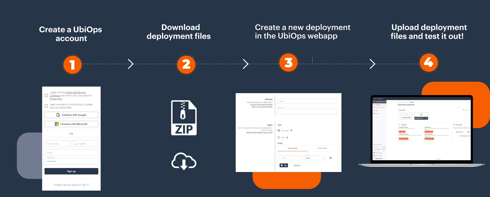
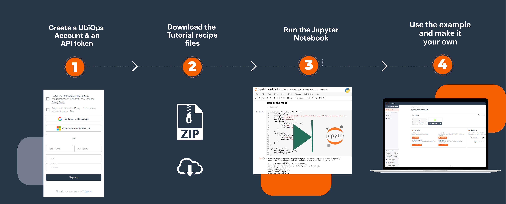

# Tutorials

Welcome to the UbiOps tutorials page!

The UbiOps tutorials page is here to provide (new) users with inspiration on how to work with UbiOps. Use it to find
inspiration or to discover new ways of working with the UbiOps platform.

With a (free) UbiOps account you can use the tutorials to have example applications running in your own environment
in minutes.*

## How does it work?

We have three tutorial categories:
All of our tutorials contain full walkthroughs that can be run in Jupyter notebook or Rstudio. Except for the UI tutorials, they
contain ready-to-go deployment packages which illustrate how to use the deployment package for typical cases, using the WebApp.

## Requirements

To be able to use the UbiOps tutorials you need three things:

- You need to have the UbiOps client library installed. For Python this can be done via pip install or via Setuptools. For more
information see our <a href="https://github.com/UbiOps/client-library-python" target="_blank">GitHub Python page</a>. For R this can be done by installing the devtools package and then using the install_github function. For more information see our <a href="https://github.com/UbiOps/client-library-r" target="_blank">GitHub R page</a> 

- If you want to run Python tutorials, you need to be able to run Jupyter Notebook. See the <a href="https://jupyter.org/install" target="_blank">installation guide</a>
  for more information.

- If you want to run R script tutorials, you need to be able to run Rstudio. See the <a href="https://docs.rstudio.com/installation/" target="_blank">installation guide</a> for more information.

- You need to have a UbiOps account. You can create a free account <a href="https://app.ubiops.com/sign-up" target="_blank">here</a>.

### UI tutorials

The UI tutorials show how to set up your deployment package for typical use cases. You can download the
deployment package, fill in the deployment creation form in the UI, and upload the deployment package. Afterwards
you can make a request to the deployment to test it out.

### Tutorials

Every *tutorial* contains a standalone example with all the material you need to run it. They are all centered around
a Jupyter Notebook or Rstudio script. If you download the tutorial folder and run the notebook/script it will build the example in your own
UbiOps account.

## The current Python Tutorials
| Topic and link to tutorial                                                                                                                                   | Functionalities of UbiOps addressed      |
|--------------------------------------------------------------------------------------------------------------------------------------------------------------|------------------------------------------|
| [Creating a training and production pipeline with Scikit Learn in UbiOps](scikit-deployment/scikit-deployment.md)                                            | Deployments, pipelines                   |
| [Deploying a TensorFlow model in UbiOps](tensorflow-example/tensorflow-example.md)                                                                           | Deployments                              |
| [Deploying an XGBoost model in UbiOps](xgboost-deployment/xgboost-deployment.md)                                                                             | Deployments                              |
| [Convert your MLFlow model to UbiOps deployment](mlflow-conversion/MlFlow-Conversion-Tutorial.md)                                                            | Deployments                              |
| [Training a Tensorflow model](tensorflow-training/tensorflow-training.md)                                                                                    | Training                                 |
| [Training an XGBoost model](xgboost-training/xgboost-training.md) | Training
| [Checkpointing TensorFlow model training in UbiOps](checkpoint-tensorflow/checkpoint-tensorflow.md)                                                          | Training                                 |
| [Retraining a PyTorch model in UbiOps](retrain-resnet-pytorch/retrain-resnet-pytorch.md)                                                                     | Training, Logs                           |
| [Triggering a deployment/pipeline request from Azure Functions](azure-functions-triggered-request/azure-functions-triggered-request.md)                      | Different forms of requests, integration |
| [Triggering a deployment/pipeline request from Google Cloud Functions](google-cloud-functions-triggered-request/google-cloud-functions-triggered-request.md) | Different forms of requests, integration |
| [Azure Data Factory and UbiOps pipeline interaction tutorial](azure-data-factory/azure-data-factory.md)                                                      | Integration, pipelines                   |
| [Using Azure ML services to train a model and deploy on UbiOps](azure-machine-learning/azure-machine-learning.md)                                            | Integration, deployments                 |
| [Pipeline that matches, orders and visualises a list of Pokemon](pokemon-pipeline/pokemon-pipeline.md)                                                       | Pipelines                                | 
| [Combining R and Python in the same pipeline: the prediction of house prices](pythonr-pipeline/pythonr-pipeline.md)                                          | Deployments, pipelines                   |
| [RFM analysis for Google Sheets with a pipeline](gsheet-rfm-pipeline/gsheet-rfm-pipeline.md)                                                                 | Pipelines, Requests, Environment vars    |
| [How to turn your deployment into a live web app using Streamlit](streamlit-tutorial/streamlit-tutorial.md)                                                  | Deployments, Integration                 | 
| [Using TensorRT in Ubiops](tensorrt-tutorial/tensorrt-tutorial.md)                                                                                           | Deployments, Integration, Requests       |
| [Accelerate workflows with NVIDIA RAPIDS](nvidia-rapids-benchmark/nvidia-rapids-benchmark-tutorial.md)                                                       | Local testing, Environments, Training    |
| [Huggingface & BERT](huggingface-bert/huggingface-bert.md)                                                                                                   | Deployments, Integration, Requests, GenAI   |
| [Huggingface & Stable Diffusion](huggingface-stable-diffusion/stable_diffusion_deployment.md) | Deployments, Integration, Requests, GenAI|
| [Hugginface & Mistral 7B with development setup](huggingface-mistral7b/huggingface-mistral7b.md) | Deployments, Integration, Requests, GenAI |
| [Implement RAG with Langchain on UbiOps](rag-mistral-langchain/rag-mistral-langchain.md) | Deployments, Integration, Requests, Pipelines, GenAI|
| [Deploy Llama 3 from Hugginface](huggingface-llama3/huggingface-llama3.md) | Deployments, Integration, Requests, GenAI|
| [Fine-tuning Falcon](finetuning-falcon/finetuning-falcon.md)| Training, Integration, GenAI |
                                     

## The current R Tutorials

| Topic and link to tutorial                                                                                          | Functionalities of UbiOps addressed |
|---------------------------------------------------------------------------------------------------------------------|-------------------------------------|
| [Combining R and Python in the same pipeline: the prediction of house prices](pythonr-pipeline/pythonr-pipeline.md) | Deployments, pipelines              |
| [Deploying an XGboost model](r-xgboost-deployment/r-xgboost-deployment.md)                                          | Deployments                         |
| [Deploying an R XGboost pipeline](r-xgboost-pipeline/r-xgboost-pipeline.md)                                         | Deployments, pipelines              |

## Requirements

To be able to use the UbiOps tutorials you need three things:

- You need to have the UbiOps client library installed. For Python this can be done via pip install or via Setuptools. For more
information see our <a href="https://github.com/UbiOps/client-library-python" target="_blank">GitHub Python page</a>. For R this can be done by installing the devtools package and then using the install_github function. For more information see our <a href="https://github.com/UbiOps/client-library-r" target="_blank">GitHub R page</a> 

- If you want to run Python tutorials, you need to be able to run Jupyter Notebook. See the <a href="https://jupyter.org/install" target="_blank">installation guide</a>
  for more information.

- If you want to run R script tutorials, you need to be able to run Rstudio. See the <a href="https://docs.rstudio.com/installation/" target="_blank">installation guide</a> for more information.

- You need to have a UbiOps account. You can create a free account <a href="https://app.ubiops.com/sign-up" target="_blank">here</a>.

*You might need to make some space in your project by deleting deployment versions if you want to run all the examples and stay
within the limits of your account.

