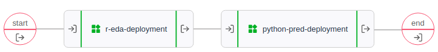
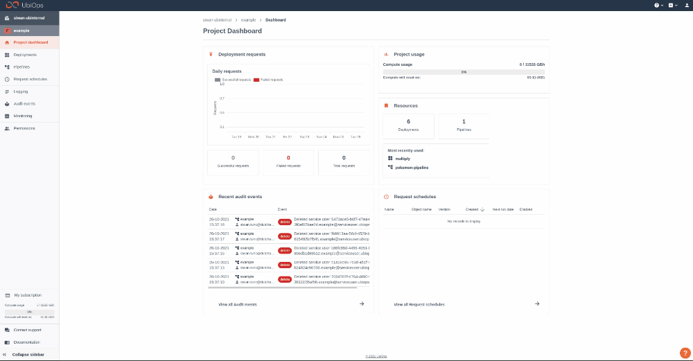

# Combine R and Python in a pipeline 

[Download notebook :fontawesome-solid-download:](https://download-github.ubiops.com/#!/home?url=https://github.com/UbiOps/tutorials/tree/master/pythonr-pipeline/pythonr-pipeline){ .md-button .md-button--primary } [View source code :fontawesome-brands-github: ](https://github.com/UbiOps/tutorials/blob/master/pythonr-pipeline/pythonr-pipeline){ .md-button .md-button--secondary }

In this example we will show you the following:

How to create a pipeline that predicts house prices using [the House Sales in King County, USA Dataset](https://kaggle.com/harlfoxem/housesalesprediction). Where the Data Exploration Analysis is written in R, and the prediction model is written in Python.

## PythonR pipeline
| Deployment| Function |Environment|
|-----------|----------|--------|
|r-eda-deployment| Prepare the data| R |
|python-pred-deployment| Make a prediction of the house prices | Python

The pipeline looks like this:

With the following inputs and outputs:

| Model| Input| Output|
|------|------|------| 
|r-eda-deployment | raw_data: File | clean_data: File |
|python-pred-deployment | clean_data: File | Prediction: File |

## How does it work?
**Step 1**: Login to your UbiOps account at https://app.ubiops.com/ and create an API token with project editor admin rights. To do so, click on **permissions* permissions in the navigation panel, and then click on API tokens. Click on **[+]Add token** to create a new token.

Give your new token a name, save the token in a safe place and assign the following roles to the token: project editor. These roles can be assigned on project level.

**Step 2**: Download the [pythonr-pipeline](https://download-github.ubiops.com/#!/home?url=https://github.com/UbiOps/tutorials/tree/master/pythonr-pipeline/pythonr-pipeline){:target="_blank"} folder and open the notebook. In the notebook you will find a space to enter your API token and the name of your project in UbiOps. Paste the saved API token in the notebook in the indicated spot and enter the name of the project in your UbiOps environment. This project name can be found in the top of your screen in the WebApp. In the image in step 1 the project name is example.

**Step 3**: Run the Jupyter notebook and R script in the order described at the beginning of the Jupyter notebook and everything will be automatically deployed to the UbiOps environment! Afterwards you can explore both codes or explore the application in the WebApp.

Download link for the necessary files: [PythonR files](https://download-github.ubiops.com/#!/home?url=https://github.com/UbiOps/tutorials/tree/master/pythonr-pipeline/pythonr-pipeline){:target="_blank"}.