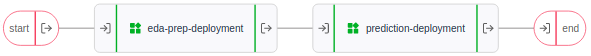

# R-prediction pipeline 

[Download notebook :fontawesome-solid-download:](https://download-github.ubiops.com/#!/home?url=https://github.com/UbiOps/tutorials/tree/master/r-xgboost-pipeline/r-xgboost-pipeline){ .md-button .md-button--primary } [View source code :fontawesome-brands-github: ](https://github.com/UbiOps/tutorials/blob/master/r-xgboost-pipeline/r-xgboost-pipeline){ .md-button .md-button--secondary }

In this example we will show the following:

How to create an R pipeline that explores and prepare data from the [King County, USA dataset](https://kaggle.com/harlfoxem/housesalesprediction), whereafter a prediction is made with the XGBoost package.  

# R-prediction pipeline
The deployment is made up of the following:

|Deployment|Function|
|-----|-----|
|eda-prep-deployment| Explores and prepares the data for a prediction|
|predicion-deployment| Makes predictions of house prices

The pipeline looks like this:

With the following inputs and outputs:

|Deployment|Input|Output|
|-----|-----|-----|
|eda-prep-deployment|raw_data: File|clean_data: File|
|prediction-deployment|clean_data: File|prediction: File|

## How does it work?

**Step 1:** Login to your UbiOps account at https://app.ubiops.com/ and create an API token with project editor admin rights. To do so, click on **Permissions** in the navigation panel and then click on **API tokens**.
Click on **[+]Add token** to create a new token.

Give your new token a name, save the token in a safe place and assign the following roles to the token: project editor.
These roles can be assigned on project level.

**Step 2:** Download the [r-xgboost-pipeline](https://download-github.ubiops.com/#!/home?url=https://github.com/UbiOps/tutorials/tree/master/r-xgboost-pipeline/r-xgboost-pipeline){:target="_blank"} folder and open r-xgboost-template.R. In the script, you will find a space to enter your API token and the name of your project in UbiOps. Paste the saved API token in the notebook in the indicated spot and enter the name of the project in your UbiOps environment. The project name can be found on the top of your screen in the WebApp. In the image in step 1 the project name is example.

**Step 3** Run the R script r-xgboost-pipeline-script and everything will be automatically deployed to your UbiOps environment! When the deployment has finished building (this takes about 15 minutes) it is possible to make a request with the dummy_data.csv, which is also in the r-xgboost-pipeline folder. Afterward, you can explore the code in the script or explore the application in the WebApp.

_Download links for the necessary files: [r-xgboost-pipeline](https://download-github.ubiops.com/#!/home?url=https://github.com/UbiOps/tutorials/tree/master/r-xgboost-pipeline/r-xgboost-pipeline){:target="_blank"}.
