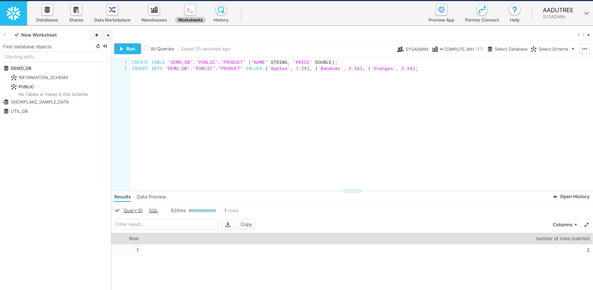

# Snowflake template

[Download notebook :fontawesome-solid-download:](https://download-github.ubiops.com/#!/home?url=https://github.com/UbiOps/tutorials/tree/master/snowflake/snowflake-ubiops-example){ .md-button .md-button--primary } [View source code :fontawesome-brands-github: ](https://github.com/UbiOps/tutorials/blob/master/snowflake/snowflake-ubiops-example){ .md-button .md-button--secondary }

On this page we will show you the following:

How to create a deployment that makes connection with the snowflake data warehouse and retrieve data. This will be a very simple example where a user can check what he can buy from our imaginary shop with the amount of money he has.


If you [download](https://download-github.ubiops.com/#!/home?url=https://github.com/UbiOps/tutorials/tree/master/snowflake/snowflake-ubiops-example){:target="_blank"} and run this entire notebook after filling in your access token and snowflake credentials, the snowflake deployment will be deployed to your UbiOps environment. You can thus check your environment after running to explore. You can also check the individual steps in this notebook to see what we did exactly and how you can adapt it to your own use case.

We recommend to run the cells step by step, as some cells can take a few minutes to finish. You can run everything in one go as well and it will work, just allow a few minutes for building the individual deployments.


## Getting the snowflake database ready


Head over to [the snowflake website](https://signup.snowflake.com/) and signup for an account or use your existing one if that applies. This example will be using the default database `DEMO_DB` then we create a simple table `product` which looks like this:
```
CREATE TABLE "DEMO_DB"."PUBLIC"."PRODUCT" ("NAME" STRING, "PRICE" DOUBLE);
```
and we insert some test data to test the functioning of our deployment later:
```
INSERT INTO "DEMO_DB"."PUBLIC"."PRODUCT" VALUES ('Apples', 1.24), ('Bananas', 3.54), ('Oranges', 2.34);

```



## Snowflake configuration + Establishing a connection with your UbiOps environment¶ 

Add your API token. Then we will provide a project name, deployment name and deployment version name. Afterwards we initialize the client library. This way we can deploy the deployment to your environment.

Also fill in the authentication configuration from your snowflake environment (These will be saved as secret environment variables on the UbiOps environment for security reasons)


```python
API_TOKEN = "<API_TOKEN>" # Make sure this is in the format "Token token-code"
PROJECT_NAME = "<PROJECT_NAME>"
DEPLOYMENT_NAME='snowflake-deployment'
DEPLOYMENT_VERSION='v1'


# Authentication configuration with the snowflake environment

# SNOWFLAKE_ACCOUNT will follow this format "<PROJECT_ID>.<REGION_OF_SNOWFLAKE>.<CLOUD_PROVIDER>"
# Example: "xxxxxx.europe-west4.gcp"
SNOWFLAKE_ACCOUNT = '<INSERT SNOWFLAKE ACCOUNT>'

SNOWFLAKE_USERNAME= '<INSERT SNOWFLAKE USERNAME>'
SNOWFLAKE_PASSWORD = '<INSERT SNOWFLAKE PASSWORD>'
SNOWFLAKE_DATABASE = 'DEMO_DB'


# Import all necessary libraries
import shutil
import os
import ubiops

client = ubiops.ApiClient(ubiops.Configuration(api_key={'Authorization': API_TOKEN}, 
                                               host='https://api.ubiops.com/v2.1'))
api = ubiops.CoreApi(client)
```

## Creating the snowflake deployment
Now that we have our snowflake environment ready let's create a UbiOps deployment that makes use of it to run queries.

In the cell below the deployment.py which will connect to the snowflake database when the deployment is built and run queries and return their result when you request that.


```python
%%writefile snowflake_deployment/deployment.py
"""
The file containing the deployment code is required to be called 'deployment.py' and should contain the 'Deployment'
class and 'request' method.
"""
import snowflake.connector as sf
import os


class Deployment:

    def __init__(self, base_directory, context):
        """
        Initialisation method for the deployment. It can for example be used for loading modules that have to be kept in
        memory or setting up connections. Load your external model files (such as pickles or .h5 files) here.

        :param str base_directory: absolute path to the directory where the deployment.py file is located
        :param dict context: a dictionary containing details of the deployment that might be useful in your code.
            It contains the following keys:
                - deployment (str): name of the deployment
                - version (str): name of the version
                - input_type (str): deployment input type, either 'structured' or 'plain'
                - output_type (str): deployment output type, either 'structured' or 'plain'
                - environment (str): programming environment the deployment is running
                - environment_variables (str): the custom environment variables configured for the deployment.
                    You can also access those as normal environment variables via os.environ
        """

        print("Initialising My Deployment")
        print('Connecting to snowflake database')

        SNOWFLAKE_ACCOUNT = os.environ.get('SNOWFLAKE_ACCOUNT')
        SNOWFLAKE_USERNAME= os.environ.get('SNOWFLAKE_USERNAME')
        SNOWFLAKE_PASSWORD = os.environ.get('SNOWFLAKE_PASSWORD')
        SNOWFLAKE_DATABASE = os.environ.get('SNOWFLAKE_DATABASE')

        try:        
            con = sf.connect(
                user=SNOWFLAKE_USERNAME,
                password=SNOWFLAKE_PASSWORD,
                account=SNOWFLAKE_ACCOUNT,
                database=SNOWFLAKE_DATABASE
            )
            self.cur = con.cursor()

        except Exception as e:
            print('There was a problem connecting to the database!')
            print(e)


    def request(self, data):
        """
        Method for deployment requests, called separately for each individual request.

        :param dict/str data: request input data. In case of deployments with structured data, a Python dictionary
            with as keys the input fields as defined upon deployment creation via the platform. In case of a deployment
            with plain input, it is a string.
        :return dict/str: request output. In case of deployments with structured output data, a Python dictionary
            with as keys the output fields as defined upon deployment creation via the platform. In case of a deployment
            with plain output, it is a string. In this example, a dictionary with the key: output.
        """

        # Price limit
        max_price = data['max_price']
        self.cur.execute(f'SELECT * from product where price < {max_price};')
        items = self.cur.fetchall()

        # No affordable items
        if len(items) == 0:
            return {
                'output': "unfortunately you cannot afford any of the items in our shop!"
            }

        # Format items that the user can purchase
        affordable_items = ', '.join(list(map(lambda x: x[0], items)))
        return {
            "output": f"You can afford to buy the following ({affordable_items})"
        }

```


## Deploying to UbiOps¶

Now we have all the pieces we need to create our deployment on UbiOps. In the cell below as you see a deployment is being created, then a version of the deployment is created and the deployment code is zipped and uploaded.


```python
# Create the deployment
deployment_template = ubiops.DeploymentCreate(
    name=DEPLOYMENT_NAME,
    description='Snowflake deployment',
    input_type='structured',
    output_type='structured',
    input_fields=[
        {'name':'max_price', 'data_type':'double'}
    ],
    output_fields=[
        {'name':'output', 'data_type':'string'},
    ]
)

api.deployments_create(
    project_name=PROJECT_NAME,
    data=deployment_template
)


# Create secret environment variables for the snowflake connection
api.deployment_environment_variables_create(
    project_name=PROJECT_NAME,
    deployment_name=DEPLOYMENT_NAME,
    data=ubiops.EnvironmentVariableCreate(
        name='SNOWFLAKE_ACCOUNT', 
        value=SNOWFLAKE_ACCOUNT,
        secret=True
    )
)
api.deployment_environment_variables_create(
    project_name=PROJECT_NAME,
    deployment_name=DEPLOYMENT_NAME,
    data=ubiops.EnvironmentVariableCreate(
        name='SNOWFLAKE_USERNAME', 
        value=SNOWFLAKE_USERNAME,
        secret=True
    )
)
api.deployment_environment_variables_create(
    project_name=PROJECT_NAME,
    deployment_name=DEPLOYMENT_NAME,
    data=ubiops.EnvironmentVariableCreate(
        name='SNOWFLAKE_PASSWORD', 
        value=SNOWFLAKE_PASSWORD,
        secret=True
    )
)
api.deployment_environment_variables_create(
    project_name=PROJECT_NAME,
    deployment_name=DEPLOYMENT_NAME,
    data=ubiops.EnvironmentVariableCreate(
        name='SNOWFLAKE_DATABASE', 
        value=SNOWFLAKE_DATABASE,
        secret=True
    )
)


# Create the version
version_template = ubiops.DeploymentVersionCreate(
    version=DEPLOYMENT_VERSION,
    environment='python3-7',
    instance_type='512mb',
    minimum_instances=0,
    maximum_instances=1,
    maximum_idle_time=1800, # = 30 minutes
    request_retention_mode='none' # we don't need request storage in this example
)

api.deployment_versions_create(
    project_name=PROJECT_NAME,
    deployment_name=DEPLOYMENT_NAME,
    data=version_template
)

# Zip the deployment package
shutil.make_archive('snowflake_deployment', 'zip', '.', 'snowflake_deployment')

# Upload the zipped deployment package
file_upload_result =api.revisions_file_upload(
    project_name=PROJECT_NAME,
    deployment_name=DEPLOYMENT_NAME,
    version=DEPLOYMENT_VERSION,
    file='snowflake_deployment.zip'
)
```

## All done! Let's close the client properly.


```python
api_client.close()
```

Note: This notebook runs on Python 3.6 and uses UbiOps CLient Library 3.15.0.

## Making a request and exploring further
You can go ahead to the Web App and take a look in the user interface at what you have just built. If you want you can create a request to the snowflake deployment supplying the `max_price` parameter and see what you can afford.

So there we have it! We have created a deployment and using the snowflake  library. You can use this notebook to base your own deployments on. Just adapt the code in the deployment packages and alter the input and output fields as you wish and you should be good to go. 

For any questions, feel free to reach out to us via the customer service portal: https://ubiops.atlassian.net/servicedesk/customer/portals
